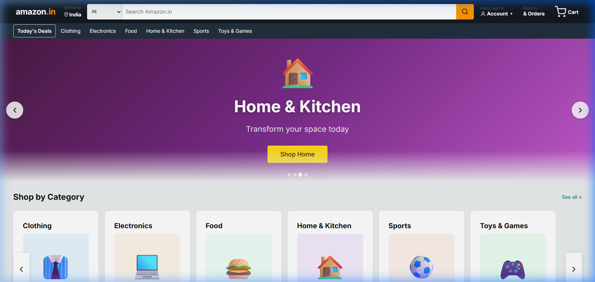
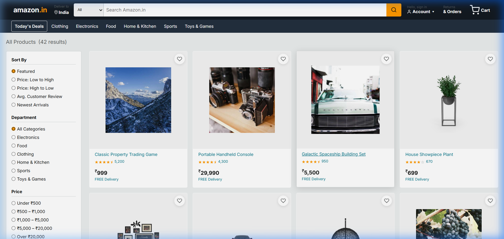
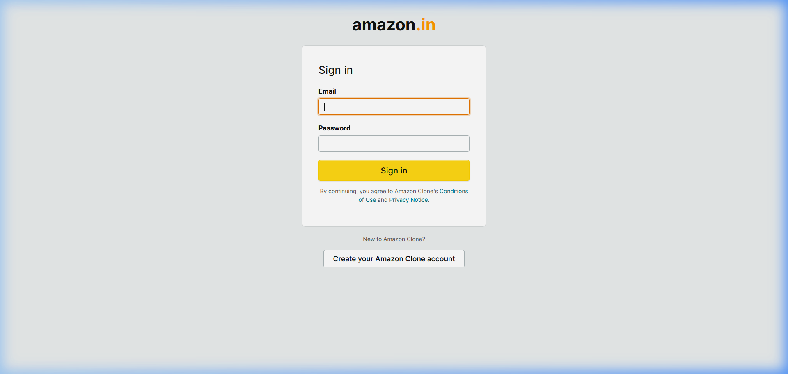

# 🛒 Amazon Clone — Full-Stack E-Commerce Application
# NOTE : CHECK SPAM FOR SIGN UP OTP

> **Scaler AI Labs Assignment**
>
> A production-ready, full-stack Amazon India clone built with **React**, **Node.js/Express**, **Prisma ORM**, and **PostgreSQL (Supabase)**.

---

## 📸 Screenshots

### Homepage — Hero Carousel & Category Browsing


### Product Listing — Filters, Search, Sort & Pagination


### Authentication — Login Page


---

## 🌐 Live Demo

| Service  | URL |
|----------|-----|
| Frontend (Vercel)  | _[Add your Vercel URL after deployment]_ |
| Backend API (Railway) | _[Add your Railway URL after deployment]_ |
| Health Check | `GET /api/health` |

---

## 🏗️ Tech Stack

| Layer | Technology |
|-------|-----------|
| **Frontend** | React 19, React Router v7, Vite 8, Vanilla CSS |
| **Backend** | Node.js, Express 5, ES Modules |
| **Database** | PostgreSQL (hosted on Supabase) |
| **ORM** | Prisma 6 (schema-first, type-safe) |
| **Authentication** | JWT (JSON Web Tokens) + bcryptjs |
| **Email** | EmailJS (OTP verification & order confirmations) |
| **Payments** | Stripe API (test mode) + Demo mode fallback |
| **Deployment** | Railway (backend) + Vercel (frontend) |

---

## ✨ Features

### 🔐 Authentication & Authorization
- Email OTP verification via EmailJS
- User registration with hashed passwords (bcryptjs)
- JWT-based session management (7-day expiry)
- Protected routes — middleware validates token on every request
- Auto-redirect to login on 401 (expired/invalid token)

### 🛍️ Product Catalog
- 42 seeded products across **6 categories**: Electronics, Food, Clothing, Home & Kitchen, Sports, Toys & Games
- **Full-text search** (case-insensitive, name matching)
- **Filter** by category, price range, and minimum rating
- **Sort** by price (asc/desc), rating, name (A-Z/Z-A), newest
- **Pagination** with configurable page size (max 50)
- Detailed product page with image gallery, specifications (JSON), and reviews

### 🛒 Shopping Cart
- Add/remove items, update quantities
- Cart persists in database (linked to user account)
- Real-time cart count in navbar
- Clear entire cart functionality

### 📦 Orders & Checkout
- Multi-step checkout flow (Address → Payment → Confirmation)
- Multiple payment methods: COD, UPI, Card, Stripe
- **Stripe integration** for real card payments (test mode)
- **Demo payment modal** as fallback (no Stripe keys needed)
- Order number generation (e.g., `ORD-1716000000000-XXXXX`)
- Order history with status tracking (PENDING → CONFIRMED → SHIPPED → DELIVERED)
- Order cancellation support

### 📍 Address Management
- Add, edit, delete delivery addresses
- Set default address
- Address validation (fullName, phone, addressLine1, city, state, pincode)

### ❤️ Wishlist
- Add/remove products to wishlist
- Wishlist page with product details
- Unique constraint — same product can't be wishlisted twice

### ⭐ Reviews & Ratings
- Submit reviews with 1–5 star rating, title, comment, and images
- One review per user per product (enforced by unique constraint)
- Automatic product rating recalculation on new review
- Paginated review listing

### 👤 Account Management
- View and edit profile (name, phone)
- View order history from account page

### 🎨 UI/UX Design
- Pixel-accurate Amazon India clone styling
- Responsive layout (desktop + mobile)
- Auto-rotating hero carousel with gradient backgrounds
- Horizontal scroll rows with navigation arrows
- Category cards with emoji icons
- Star rating component
- Toast notifications
- Loading spinners
- 404 Not Found page

---

## 📁 Project Structure

```
amazon_clone/
├── backend/                    # Express.js REST API
│   ├── prisma/
│   │   ├── schema.prisma       # Database schema (13 models)
│   │   ├── seed.js             # Seed script (42 products, 6 categories)
│   │   └── migrations/         # Prisma migration files
│   ├── src/
│   │   ├── controllers/        # Request handlers
│   │   │   ├── authController.js
│   │   │   ├── productController.js
│   │   │   ├── categoryController.js
│   │   │   ├── cartController.js
│   │   │   ├── orderController.js
│   │   │   ├── addressController.js
│   │   │   ├── wishlistController.js
│   │   │   └── paymentController.js
│   │   ├── routes/             # Route definitions
│   │   │   ├── authRoutes.js
│   │   │   ├── productRoutes.js
│   │   │   ├── categoryRoutes.js
│   │   │   ├── cartRoutes.js
│   │   │   ├── orderRoutes.js
│   │   │   ├── addressRoutes.js
│   │   │   ├── wishlistRoutes.js
│   │   │   └── paymentRoutes.js
│   │   ├── middleware/
│   │   │   ├── auth.js         # JWT verification
│   │   │   ├── errorHandler.js # Global error handler (Prisma-aware)
│   │   │   └── validate.js     # express-validator runner
│   │   ├── services/
│   │   │   └── emailService.js # EmailJS integration
│   │   └── lib/
│   │       ├── prisma.js       # Singleton Prisma client
│   │       └── generateOrderNumber.js
│   ├── server.js               # App entry point
│   ├── package.json
│   └── .env.example
│
├── frontend/                   # React SPA (Vite)
│   ├── src/
│   │   ├── api/                # Axios API layer
│   │   │   ├── axios.js        # Base config + interceptors
│   │   │   ├── authApi.js
│   │   │   ├── productApi.js
│   │   │   ├── categoryApi.js
│   │   │   ├── cartApi.js
│   │   │   ├── orderApi.js
│   │   │   ├── addressApi.js
│   │   │   ├── wishlistApi.js
│   │   │   └── paymentApi.js
│   │   ├── pages/              # Page components (12 pages)
│   │   │   ├── Home.jsx        # Hero carousel + category rows
│   │   │   ├── Products.jsx    # Product listing + filters
│   │   │   ├── ProductDetail.jsx
│   │   │   ├── Cart.jsx
│   │   │   ├── Checkout.jsx    # Multi-step checkout + Stripe
│   │   │   ├── Orders.jsx
│   │   │   ├── OrderDetail.jsx
│   │   │   ├── Account.jsx
│   │   │   ├── Wishlist.jsx
│   │   │   ├── Login.jsx
│   │   │   ├── Register.jsx    # OTP verification flow
│   │   │   └── NotFound.jsx
│   │   ├── components/
│   │   │   ├── layout/         # Navbar, SubNavbar, Footer, ProtectedRoute
│   │   │   ├── product/        # ProductCard, ProductGrid, ProductFilters
│   │   │   ├── cart/           # CartItem, CartSummary
│   │   │   ├── payment/        # StripePaymentModal, DemoPaymentModal
│   │   │   ├── order/          # OrderStatusBadge
│   │   │   └── ui/             # Modal, Spinner, StarRating
│   │   ├── context/            # React Context providers
│   │   │   ├── AuthContext.jsx
│   │   │   ├── CartContext.jsx
│   │   │   └── ToastContext.jsx
│   │   ├── utils/
│   │   │   ├── storage.js      # LocalStorage abstraction
│   │   │   ├── formatPrice.js  # ₹ currency formatting
│   │   │   └── useDebounce.js  # Search debounce hook
│   │   ├── styles/
│   │   │   └── index.css       # Complete design system (50KB)
│   │   ├── App.jsx             # Router + layout
│   │   └── main.jsx            # React entry point
│   ├── index.html
│   ├── vercel.json             # SPA routing for Vercel
│   ├── vite.config.js
│   ├── package.json
│   └── .env.example
│
└── screenshots/                # App screenshots
```

---

## 🔌 API Reference

Base URL: `/api`

### Authentication
| Method | Endpoint | Auth | Description |
|--------|----------|------|-------------|
| `POST` | `/auth/send-otp` | ❌ | Send OTP to email |
| `POST` | `/auth/verify-otp` | ❌ | Verify 6-digit OTP |
| `POST` | `/auth/register` | ❌ | Register new user |
| `POST` | `/auth/login` | ❌ | Login (returns JWT) |
| `GET` | `/auth/me` | ✅ | Get current user profile |
| `PUT` | `/auth/me` | ✅ | Update profile |

### Products
| Method | Endpoint | Auth | Description |
|--------|----------|------|-------------|
| `GET` | `/products` | ❌ | List products (search, filter, sort, paginate) |
| `GET` | `/products/:slug` | ❌ | Get product detail by slug |
| `GET` | `/products/:id/reviews` | ❌ | Get paginated reviews |
| `POST` | `/products/:id/reviews` | ✅ | Submit a review (1-5 stars) |

### Categories
| Method | Endpoint | Auth | Description |
|--------|----------|------|-------------|
| `GET` | `/categories` | ❌ | List all categories |
| `GET` | `/categories/:slug` | ❌ | Get category with products |

### Cart
| Method | Endpoint | Auth | Description |
|--------|----------|------|-------------|
| `GET` | `/cart` | ✅ | Get user's cart |
| `POST` | `/cart/items` | ✅ | Add item to cart |
| `PUT` | `/cart/items/:itemId` | ✅ | Update item quantity |
| `DELETE` | `/cart/items/:itemId` | ✅ | Remove item |
| `DELETE` | `/cart` | ✅ | Clear cart |

### Orders
| Method | Endpoint | Auth | Description |
|--------|----------|------|-------------|
| `POST` | `/orders` | ✅ | Place order |
| `GET` | `/orders` | ✅ | Get order history |
| `GET` | `/orders/:orderNumber` | ✅ | Get order details |
| `PUT` | `/orders/:orderNumber/cancel` | ✅ | Cancel order |

### Addresses
| Method | Endpoint | Auth | Description |
|--------|----------|------|-------------|
| `GET` | `/addresses` | ✅ | List addresses |
| `POST` | `/addresses` | ✅ | Add address |
| `PUT` | `/addresses/:id` | ✅ | Update address |
| `DELETE` | `/addresses/:id` | ✅ | Delete address |
| `PUT` | `/addresses/:id/default` | ✅ | Set default |

### Wishlist
| Method | Endpoint | Auth | Description |
|--------|----------|------|-------------|
| `GET` | `/wishlist` | ✅ | Get wishlist |
| `POST` | `/wishlist` | ✅ | Add to wishlist |
| `DELETE` | `/wishlist/:productId` | ✅ | Remove from wishlist |

### Payments (Stripe)
| Method | Endpoint | Auth | Description |
|--------|----------|------|-------------|
| `GET` | `/payments/config` | ❌ | Get Stripe publishable key |
| `POST` | `/payments/create-intent` | ✅ | Create Stripe PaymentIntent |

### Health Check
| Method | Endpoint | Auth | Description |
|--------|----------|------|-------------|
| `GET` | `/health` | ❌ | API status check |

---

## 🗃️ Database Schema

**13 models** managed by Prisma with PostgreSQL:

```
User ──┬── Cart ── CartItem ── Product
       ├── Address ── Order ── OrderItem ── Product
       ├── Wishlist ── Product
       └── Review ── Product

Category ── Product
Otp (standalone - email verification)
```

**Key design decisions:**
- `cuid()` primary keys for all models (URL-safe, globally unique)
- `@@unique` constraints on cart items (cartId + productId), wishlist (userId + productId), and reviews (userId + productId) to prevent duplicates
- `onDelete: Cascade` on user-owned entities for clean user deletion
- `priceAtPurchase` snapshot in OrderItem to preserve price history
- `specifications` field as `Json?` for flexible key-value product attributes
- Database indexes on `categoryId`, `price`, `rating`, `userId`, and `orderNumber` for query performance

---

## 🚀 Getting Started

### Prerequisites
- **Node.js** ≥ 18
- **npm** ≥ 9
- **PostgreSQL** database (or [Supabase](https://supabase.com) free tier)

### 1. Clone the Repository

```bash
git clone https://github.com/YOUR_USERNAME/amazon-clone.git
cd amazon-clone
```

### 2. Backend Setup

```bash
cd backend
npm install

# Copy env file and fill in your values
cp .env.example .env
# Edit .env with your DATABASE_URL, JWT_SECRET, etc.

# Generate Prisma client
npx prisma generate

# Run migrations
npx prisma migrate dev

# Seed the database (42 products, 6 categories)
npx prisma db seed

# Start the server
npm run dev      # Development (nodemon)
npm start        # Production
```

### 3. Frontend Setup

```bash
cd frontend
npm install

# (Optional) Create .env for custom API URL
# cp .env.example .env

# Start dev server
npm run dev
```

The app will be available at `http://localhost:5173`

### 4. Environment Variables

#### Backend (`backend/.env`)

| Variable | Required | Description |
|----------|----------|-------------|
| `DATABASE_URL` | ✅ | PostgreSQL connection string |
| `DIRECT_URL` | ✅ | Direct DB URL (for migrations) |
| `JWT_SECRET` | ✅ | Secret key for JWT signing |
| `JWT_EXPIRES_IN` | ❌ | Token expiry (default: `7d`) |
| `PORT` | ❌ | Server port (default: `5000`) |
| `STRIPE_SECRET_KEY` | ❌ | Stripe secret key (test mode) |
| `STRIPE_PUBLISHABLE_KEY` | ❌ | Stripe publishable key |
| `EMAILJS_SERVICE_ID` | ❌ | EmailJS service ID |
| `EMAILJS_PUBLIC_KEY` | ❌ | EmailJS public key |
| `EMAILJS_PRIVATE_KEY` | ❌ | EmailJS private key |
| `EMAILJS_OTP_TEMPLATE_ID` | ❌ | EmailJS OTP template |
| `EMAILJS_ORDER_TEMPLATE_ID` | ❌ | EmailJS order template |

#### Frontend (`frontend/.env`)

| Variable | Required | Description |
|----------|----------|-------------|
| `VITE_API_URL` | ❌ | Backend API URL (default: `http://localhost:5000/api`) |

---

## 🌍 Deployment

### Backend → Railway

1. Push backend code to a GitHub repository
2. Go to [railway.app](https://railway.app) → **New Project** → **Deploy from GitHub Repo**
3. Add all environment variables from `.env.example` in Railway dashboard
   > **Note:** Railway auto-sets `PORT` — do NOT set it manually
4. Railway auto-detects Node.js and runs the `build` script:
   ```
   npm install && npx prisma generate && npx prisma migrate deploy
   ```
5. Generate a public domain in **Settings → Networking**
6. Run the seed command via Railway CLI if needed:
   ```bash
   railway run npx prisma db seed
   ```

### Frontend → Vercel

1. Push frontend code to a GitHub repository
2. Go to [vercel.com](https://vercel.com) → **Add New Project** → Import repo
3. Set environment variable:
   - `VITE_API_URL` = `https://your-railway-app.up.railway.app/api`
4. Vercel auto-detects Vite → builds and deploys
5. The `vercel.json` file handles SPA routing (all routes → `index.html`)

---

## 🔒 Security Considerations

- **Passwords** are hashed using `bcryptjs` before storage (never stored in plaintext)
- **JWT tokens** are signed with a server-side secret and validated on every protected request
- **Input validation** via `express-validator` on all mutating endpoints
- **CORS** is configured to accept all origins (`*`) for demonstration purposes
- **Prisma ORM** provides parameterized queries, preventing SQL injection
- **Error handler** catches Prisma-specific errors (P2002 duplicate, P2025 not found, P2003 invalid reference) and returns clean JSON responses — never exposes stack traces in production
- **OTP codes** are hashed (bcryptjs) before DB storage with a 10-minute expiry window
- **401 interceptor** on frontend auto-clears auth state on expired/invalid tokens

---

## 🧪 API Testing

A test script is included for automated endpoint testing:

```bash
cd backend
node test-apis.js
```

This tests all major flows: registration, login, product listing, cart operations, order placement, etc.

---

## 📊 Architecture Highlights

### Backend Architecture
```
Request → Express Router → Middleware (auth + validate) → Controller → Prisma ORM → PostgreSQL
                                                              ↓
                                                        Error Handler → JSON Response
```

### Frontend Architecture
```
React App → React Router v7 → Pages → API Layer (Axios) → Backend API
                                ↓
                          Context Providers (Auth, Cart, Toast)
                                ↓
                          Reusable Components (ProductCard, Modal, etc.)
```

### Key Design Patterns
- **Singleton Prisma Client** — prevents connection pool exhaustion during development hot-reloads
- **Layered architecture** — routes → controllers → Prisma (no service layer for simplicity)
- **API interceptors** — automatic JWT attachment + 401 redirect
- **React Context** for global state (auth, cart count, toast notifications)
- **Debounced search** — prevents API spam during typing

---

## 📝 Assignment Scope & What Was Built

| Requirement | Status | Notes |
|-------------|--------|-------|
| Product listing with search & filters | ✅ | Full-text search, category/price/rating filters, sort, pagination |
| Product detail page | ✅ | Image gallery, specs, reviews, add to cart |
| User authentication | ✅ | JWT + OTP email verification |
| Shopping cart | ✅ | Full CRUD, persisted in DB |
| Checkout & orders | ✅ | Multi-step flow, Stripe + COD |
| Responsive design | ✅ | Desktop + mobile layouts |
| Database design | ✅ | 13 models, proper indexing, constraints |
| REST API | ✅ | 30+ endpoints with validation |
| Deployment ready | ✅ | Railway + Vercel configured |

---

## 👨‍💻 Author

**Deepanshu** — Indian Institute of Information Technology, Kota

---

## 📄 License

This project was built as part of the Scaler AI recruitment process. For educational and demonstration purposes only.
